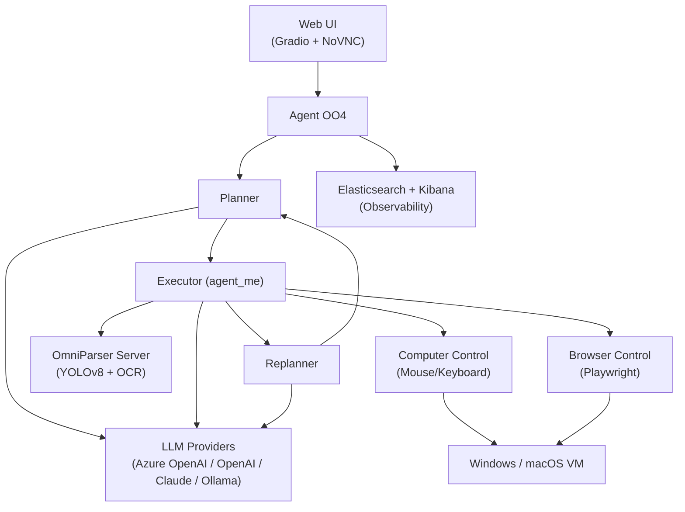

# OpenOperator

[](https://www.python.org/)
[](https://fastapi.tiangolo.com/)
[](https://pytorch.org/)
[](https://openai.com/)
[](https://www.anthropic.com/)
[](https://playwright.dev/)
[](https://www.docker.com/)
[](https://www.elastic.co/)
[](https://www.terraform.io/)
[](https://kubernetes.io/)

> AI-powered autonomous agent that controls computers through visual understanding and task planning.

OpenOperator uses multi-modal LLMs to analyze screenshots, create step-by-step plans, and execute desktop tasks autonomously — clicking, typing, navigating applications, and self-correcting when things go wrong. It supports Windows and macOS, with a web-based UI for task submission and live desktop viewing.

## Features

- **Plan-and-Solve Workflow** — generates structured plans, executes steps with validation, and dynamically replans on failure (inspired by [arxiv.org/abs/2305.04091](https://arxiv.org/abs/2305.04091))
- **Multi-Modal Perception** — screenshot analysis via OmniParser (YOLOv8 + OCR) for UI element detection and text extraction
- **Multi-Provider LLM Support** — Azure OpenAI, OpenAI GPT-4o, Anthropic Claude, and Ollama (local inference) through a unified client
- **Cross-Platform Computer Control** — Windows (pywinauto), macOS (PyAutoGUI), and browser automation (Playwright)
- **Web UI with Live Desktop View** — Gradio chat interface with NoVNC integration for real-time desktop monitoring
- **Observability** — Elasticsearch + Kibana for logs, telemetry, and execution tracking
- **Configuration-Driven Tasks** — JSON scenario definitions with pre/post-task functions and evaluation criteria

## Architecture



## Quick Start

### Prerequisites

- Python 3.12+
- [uv](https://docs.astral.sh/uv/) package manager
- Docker & Docker Compose
- GPU recommended for OmniParser (CUDA 12.6+)

### Run Everything with Docker Compose

```bash
docker compose up
```

This starts OmniParser, Elasticsearch, and Kibana. Uncomment the `windowscomputer` and `agentoo1` services in `compose.yml` for the full stack.

### Run Components Individually

**1. Start a Windows computer (Docker, requires KVM)**

```bash
cd computers/windows/docker
docker compose up
```

See [computers/README.md](./computers/README.md) for other options (Parallels VM, macOS).

**2. Start the OmniParser server**

```bash
cd servers/server_omniparser
uv run server.py
```

**3. Start the agent**

```bash
cd agents/agent_oo4
uv venv && source .venv/bin/activate
uv sync
cd ..
uv run -m agent_oo4.main
```

**4. Start the Web UI**

```bash
cd ui
uv run app.py
# Open http://127.0.0.1:7860
```

## Configuration

### Environment Variables

Create `.env` files in the appropriate directories. Key variables:

| Variable | Description | Default |
|----------|-------------|---------|
| `AZURE_OPENAI_BASEURL` | Azure OpenAI endpoint URL | — |
| `AZURE_API_KEY` | Azure OpenAI API key | — |
| `AZURE_MODEL` | Azure model name | `gpt-4o` |
| `AZURE_MODEL_DEPLOYMENT_NAME` | Azure deployment name | — |
| `OMNIPARSER_URL` | OmniParser service URL | `http://127.0.0.1:8000` |
| `COMPUTER_CONTROL_URL` | Computer control service URL | `http://127.0.0.1:5050` |
| `BROWSER_CONTROL_URL` | Browser control service URL | `http://127.0.0.1:5051` |
| `OPENAI_API_KEY` | OpenAI API key (optional) | — |
| `ANTHROPIC_API_KEY` | Anthropic API key (optional) | — |
| `OLLAMA_URL` | Ollama endpoint (optional) | `http://127.0.0.1:11434` |

### Task Scenarios

Tasks are defined as JSON files in `agents/configs/`. Example (`agents/configs/teams/scenario-2.json`):

```json
{
  "instruction": "Find chats in Teams, switch between 5 chat threads, summarize the latest chat",
  "workflow.params": {
    "max_plan_versions": 20,
    "max_plan_step_iterations": 3,
    "max_plan_step_actions": 5
  },
  "environment.start": [
    { "func": "close_all_windows" },
    { "func": "start_network_proxy" },
    { "func": "open_application", "args": { "app_name": "ms-teams" } }
  ]
}
```

## Project Structure

```
├── agents/
│   ├── agent_oo4/           # Main agent (Plan-and-Solve workflow)
│   │   └── workflow/        # Planner, Executor, Replanner nodes
│   ├── core/                # Shared library (LLM clients, state, config)
│   ├── configs/             # Task scenario definitions (JSON)
│   └── functions/           # Pre/post-task functions
├── servers/
│   ├── server_omniparser/   # UI parsing service (YOLOv8 + OCR)
│   ├── server_computer_control/  # Mouse/keyboard control
│   ├── server_browser_control/   # Playwright browser automation
│   ├── server_network_proxy/     # MITM proxy for traffic capture
│   ├── server_evaluator/         # Task evaluation service
│   └── server_teams_control/     # Microsoft Teams automation
├── computers/
│   ├── windows/             # Windows VM setup (Docker/Parallels)
│   └── macos/               # macOS Docker setup
├── models/                  # Local model configurations
├── ui/                      # Web UI (Gradio + NoVNC)
├── infra/                   # Infrastructure as Code
├── compose.yml              # Docker Compose orchestration
└── docs/                    # Additional documentation
```

## Analytics

Elasticsearch and Kibana are included for observability. After running `docker compose up`, open Kibana at [http://localhost:5601](http://localhost:5601) to view agent logs and telemetry.

## Contributing

1. Fork the repository
2. Create your feature branch (`git checkout -b feature/amazing-feature`)
3. Commit your changes (`git commit -m 'Add amazing feature'`)
4. Push to the branch (`git push origin feature/amazing-feature`)
5. Open a Pull Request
